# 🧠 GPT2-Small Spam Classifier — *Built from Scratch & Fine-Tuned*


---

## 📝 Table of Contents
- [📌 About the Project](#-about-the-project)
- [📉 Model Performance](#-model-performance)
- [🧠 Architecture Overview](#-architecture-overview)
- [🛠️ Requirements](#️-requirements)
- [🚀 How to Use](#-how-to-use)
- [🧪 Sample Inference](#-sample-inference)
- [📘 Credits](#-credits)
- [📄 License](#-license)
- [📧 Contact](#-contact)

---

## 📌 About the Project

This project demonstrates how to **build a GPT2-Small (124M parameters) transformer model from scratch using PyTorch**, tokenize input using OpenAI's `tiktoken`, and fine-tune the model for **binary text classification** (spam vs. not spam).

Key Highlights:
- Implements Transformer, MultiHeadAttention, LayerNorm, and PositionalEncoding from scratch
- Integrates a classification head for binary prediction
- Achieves high accuracy and generalization across datasets
- Includes visualizations for accuracy/loss and architectural diagrams

---

## 📉 Model Performance

| Dataset    | Accuracy (%) | Loss     |
|------------|--------------|----------|
| **Train**      | 98.75%       | 0.772    |
| **Validation** | 95.97%       | 0.764    |
| **Test**       | 94.00%       | 0.789    |

> 📈 The model generalizes well across unseen data and maintains high precision

---

## 🧠 Architecture Overview

### 🧱 Before Fine-Tuning (Original GPT-2)


### 🛠️ After Fine-Tuning (Spam Classifier)

```mermaid
flowchart TD
    %% ==== Styling ====
    classDef gpt fill:#e6f2ff,stroke:#3399ff,stroke-width:2px,color:#333;
    classDef clf fill:#fff4e6,stroke:#ff9933,stroke-width:2px,color:#333;

    %% ==== AFTER FINE-TUNING ====
    subgraph "Fine-Tuned GPT for Classification"
        direction TB
        A2["Input Text"] --> B2["Tokenizer<br>(tiktoken)"]
        B2 --> C2["Token IDs"]
        C2 --> D2["Embedding Layer<br>(Token + Positional)"]
        D2 --> E2["Transformer Blocks<br>×12"]
        E2 --> F2["Final LayerNorm"]
        F2 --> G2["Classification Head<br>(Linear 768 → 2)"]
        G2 --> H2["Output Label<br>(spam / not spam)"]
        
        class D2,E2,F2,G2 clf
    end
```


## 🛠️ Requirements
```python
pip install torch tiktoken matplotlib pandas scikit-learn
```

## 🚀 How to Use
1. **Clone the repository**
```bash

git clone https://github.com/syed-masood-pro/gpt2-spam-classifier.git
cd gpt2-spam-classifier
```
2. **Prepare the dataset**

Place your spam dataset (CSV format) in the data/ directory with columns:

* `text`: Message content

* `label`: 0 for ham, 1 for spam

3. **Run the training script**
```bash
python train.py \
  --data_path data/spam_dataset.csv \
  --epochs 10 \
  --batch_size 32 \
  --learning_rate 1e-4 \
  --max_length 256
```
4. **Evaluate the model**
```bash
python evaluate.py \
  --model_path models/gpt2_spam_classifier.pt \
  --test_data data/test.csv
```
5. **Use the trained model for inference**
```python
from inference import classify_text

# Load model
model = load_model("models/gpt2_spam_classifier.pt")

# Classify new text
text = "Claim your free prize now! Limited time offer!"
prediction = classify_text(text, model)
print(f"Prediction: {'spam' if prediction == 1 else 'not spam'}")
```

## 🧪 Sample Inference
```python
# Spam example
text = "Congratulations! You've won a free iPhone! Click to claim."
print(classify_text(text, model))
# Output: spam

# Ham example
text = "Hi, are we still on for the meeting tomorrow at 10 AM?"
print(classify_text(text, model))
# Output: not spam

# Phishing attempt
text = "Urgent: Your account security is at risk. Verify now: http://fake-security.com"
print(classify_text(text, model))
# Output: spam

# Legitimate marketing
text = "Our summer sale starts next week - 30% off all items!"
print(classify_text(text, model))
# Output: not spam
```

## 📘 Credits
* OpenAI's [tiktoken](https://github.com/openai/tiktoken) tokenizer 

* GPT2 paper inspiration: [Language Models are Unsupervised Multitask Learners](https://cdn.openai.com/better-language-models/language_models_are_unsupervised_multitask_learners.pdf)

* Dataset inspiration: [SMS Spam Collection Dataset](https://archive.ics.uci.edu/static/public/228/sms+spam+collection.zip)

## 📄 License
This project is licensed under the MIT License. See LICENSE for details.

## 📧 Contact
Syed Masood

✉️ [syedmasood.pro@gmail.com](syedmasood.pro@gmail.com)

🔗 [GitHub Profile](https://github.com/syed-masood-pro/)

💼 [LinkedIn](https://www.linkedin.com/in/syed-masood-pro/)
